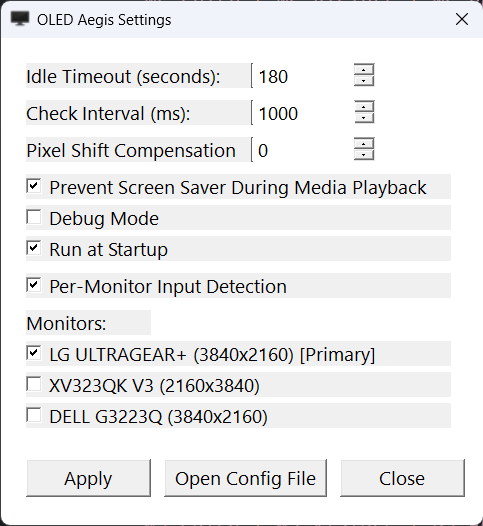

# OLED Aegis

A Windows screen saver app tailored for OLED monitors.

## Why I made this

I found that Windows 11 built-in screen saver had these issues:

* Randomly not activating after putting the computer to sleep.
* Breaks Bluetooth pause/play interactions when the screen saver is active.
* **No way to only turn on screen saver on one monitor in a
  multi-monitor setup.** (I only want to enable the screen saver on my OLED
  monitor)

Solution: make my own screen saver app and give it a bad name.

OLED Aegis solves these problems by implementing a screen saver app in the
simplest way possible: draw a black fullscreen window after a period of user
inactivity on the specified monitors.

> **Note**: It should work just fine on Windows 10, but I only tested it on Windows 11.

## Download & Installation

Download the latest `oled_aegis.exe` from the [Releases page](https://github.com/spenserlee/oled_aegis/releases). No installation required - simply run the executable.

For convenient access, you can place it in any folder and create a shortcut, or add it to your Windows startup folder.

## Features

* **Per-Monitor Control**: Enable screen saver on specific monitors only
* **Per-Monitor Input Detection**: Optionally track input separately for each monitor, allowing unused monitors to activate screen saver while you continue using others
* **Per-Monitor Media Awareness**: Detects media playback per monitor so the screen saver only activates on static screens
* **Reliable Activation**: Consistently activates after system sleep/wake cycles
* **Minimal Resource Usage**: Written in pure C with no external dependencies
* **System Tray Integration**: Taskbar icon for easy control
* **Startup Support**: Automatically run when Windows starts

## Configuration



Configuration is stored in `%APPDATA%\OLED_Aegis\oled_aegis.ini`. This file is created automatically on first run.

### Settings

* **idleTimeout**: Seconds of inactivity before screen saver activates (default: 300 seconds = 5 minutes)
* **checkInterval**: Milliseconds between idle time checks (default: 1000ms, min: 250ms, max: 10000ms)
* **pixelShiftCompensation**: Pixels to expand the screen saver window beyond the monitor's reported bounds on each side (default: 0, disabled). Set to `4`–`8` if your QD-OLED panel's hardware pixel shift feature causes a thin strip of the desktop to appear at the screen edge during screen saver activation.
* **mediaDetectionEnabled**: Set to `1` to prevent screen saver during media playback, `0` to disable (default: 1)
* **startupEnabled**: Set to `1` to run at Windows startup, `0` to disable (default: 0)
* **debugMode**: Set to `1` to enable debug logging to `%APPDATA%\OLED_Aegis\oled_aegis_debug.log`, `0` to disable (default: 0). **Note:** only for troubleshooting issues.
* **perMonitorInputDetection**: Set to `1` to track input separately for each monitor (default: 0). When enabled, each monitor has its own idle timer based on mouse cursor position and focused window location. This allows the screen saver to activate on unused monitors while you continue working on others.
* **perMonitorMediaDetection**: Set to `1` to detect media playback per monitor instead of globally (default: 1). Only blocks the screen saver on the monitor where media is actually playing, so playback on a non-OLED display won't keep the OLED awake.
* **blockOnMutedMedia**: Set to `1` to block the screen saver even when media is muted or inaudible, e.g. muted video or OBS replay buffer (default: 0). When off, only audible media prevents the screen saver.
* **monitorEnabled_\<device\>**: Set to `1` to enable screen saver on the specified monitor, `0` to disable (default: 1 for all).

## Usage

### System Tray

* **Right-click** the tray icon to access:
  * Settings (shows config file location)
  * Enable/Disable Startup
  * Exit

* **Left-click** to toggle screen saver manually

### Behavior

#### Global Mode (default)
The screen saver will automatically activate on all enabled monitors when:
1. No user input (keyboard/mouse) for `idleTimeout` seconds
2. No media is playing (if `mediaDetectionEnabled=1`)

The screen saver will automatically deactivate from all monitors when:
1. Any user input is detected
2. Media starts playing (if `mediaDetectionEnabled=1`)

#### Per-Monitor Media Mode (`perMonitorMediaDetection=1`)
Media playback is detected per monitor. The screen saver is only blocked on the monitor where media is actually playing, so playback on a secondary monitor won't keep the OLED awake. Detection uses Windows audio session APIs to determine which process is producing audible audio, then maps the playing window to its monitor.

#### Per-Monitor Input Mode (`perMonitorInputDetection=1`)
Each enabled monitor has its own independent idle timer. Input is attributed to monitors based on:
- **Mouse movement**: Updates the idle timer for the monitor where the cursor is located
- **Keyboard input**: Updates the idle timer for the monitor containing the focused window, and also the monitor where the cursor is located

This allows you to:
- Continue using one monitor while others activate their screen savers
- Have different monitors timeout independently based on where you're actively working
- Keep your OLED monitor protected while watching content on a secondary display

## Known Limitations

**Multi-window browser media disambiguation**: When the same browser (e.g. Brave) has video-site tabs open on multiple monitors and audio is playing in one of them, OLED Aegis may block the screen saver on all monitors whose browser windows have video-site title hints (e.g. "YouTube") — not just the monitor actually playing. This is because Windows exposes audio sessions per-process, and Chromium browsers' multi-process architecture maps all tab audio to a single browser process name, making it impossible to attribute audio to a specific tab/window via Win32 APIs. Workaround: don't leave video-site tabs open and focused on the OLED while playing video on another monitor of the same browser.

## Building

Requires Visual Studio (2015 or later) with the C++ build tools installed.

### Windows (Command Prompt)
```batch
build.bat
```

### Windows (PowerShell)
```powershell
.\build.ps1
```

### WSL
```bash
./build.sh
```

### Manual Build
```batch
cl.exe src\oled_aegis.c /Fe:oled_aegis.exe /O2 /MD /link user32.lib shell32.lib ole32.lib uuid.lib gdi32.lib advapi32.lib comctl32.lib powrprof.lib psapi.lib dwmapi.lib
```

See [BUILD.md](BUILD.md) for more information.

